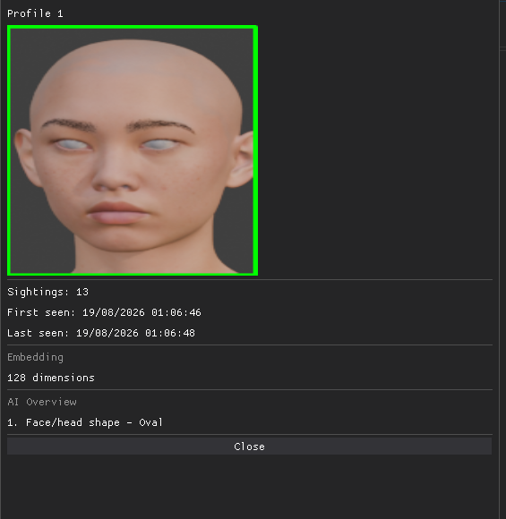
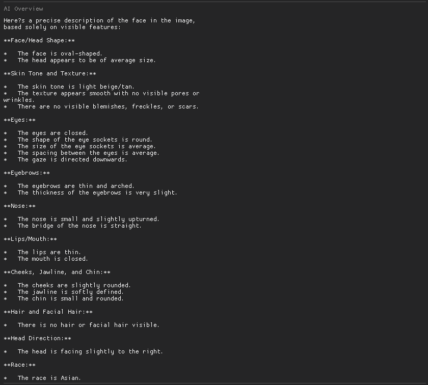
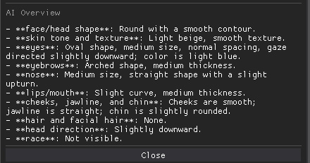
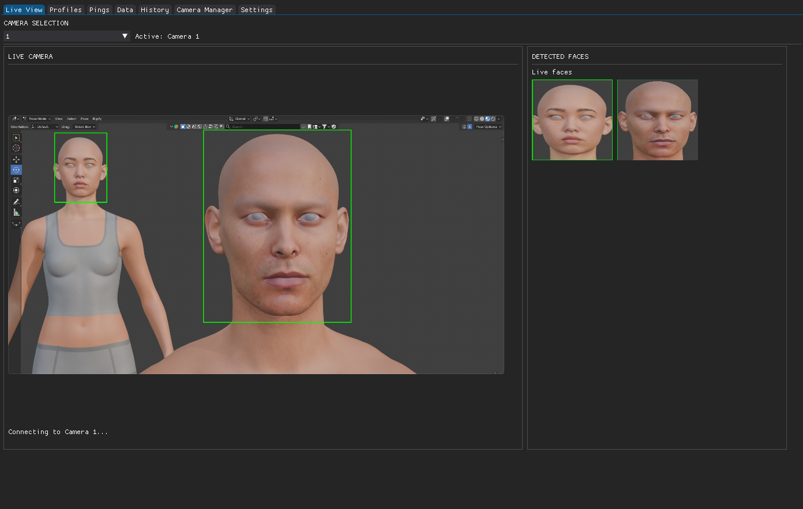
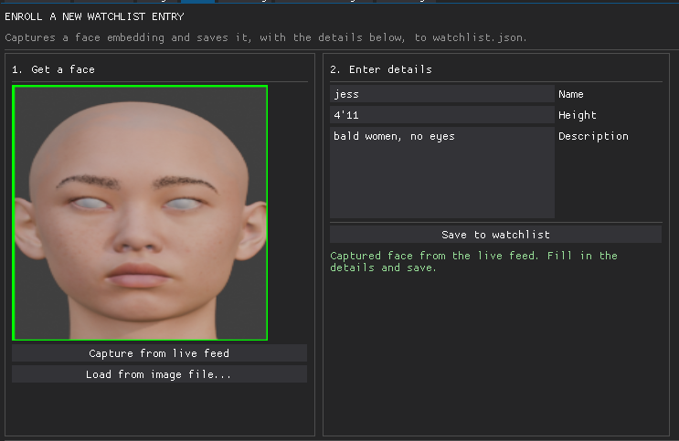
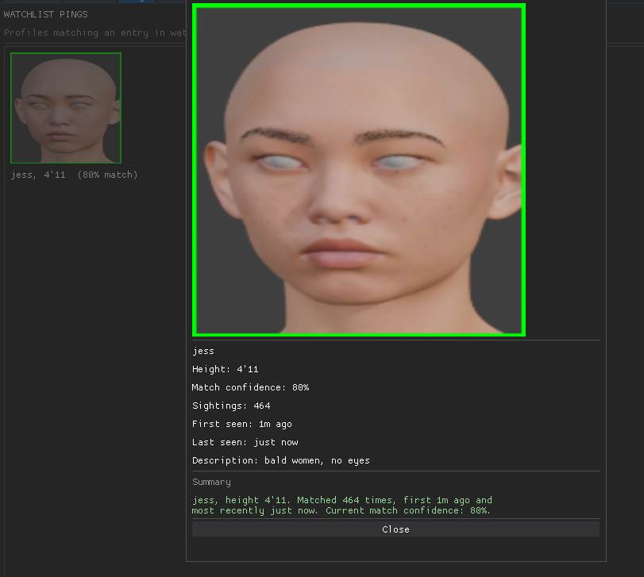
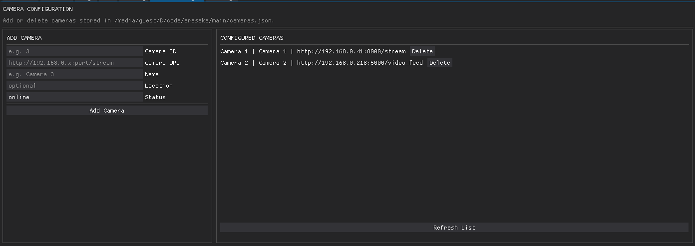

# Arasaka - Arasaka all the way to the top

> **Here is what the technology enables on a 10-year-old laptop.**

## The Idea

This isn't futuristic technology reserved for governments or huge technology companies. Many of the building blocks required for sophisticated camera-based observation are already accessible to individuals with relatively modest hardware and an internet connection.

This project demonstrates how **ANY ordinary camera can be turned into an invasive observation tool**. Adding a local LLM to the pipeline can exponentially increase the depth and versatility of the data extracted from each frame.

The purpose isn't to demonize these technologies, but to make their capabilities somewhat tangible. By demonstrating what can be observed and recorded, the project explores the increasingly important boundary between legitimate security applications and individual privacy.

**Now consider what becomes possible with hardware and resources far beyond a single 10-year-old dying laptop.**

> Governments and institutions possess computing power that far exceeds mine. They have dedicated teams, vast resources, extensive camera networks, and access to a vast array of data pools.


# Thoughts

> **Arasaka could be extended to track individuals between cameras and construct a map of their observed movements over time.**
>
> **It's genuinely scary, especially considering the free software available and the dying hardware I'm running it on.**
>
> **Why does continuously recording and analyzing someone's behavior stop feeling like stalking when we call it a security system**
> 


# Questions

> **Could an attacker exploit the way an LLM interprets encoded data, such as Base64, when that data is captured by a camera?**
>
> **What could happen if this kind of technology falls into the wrong hands?**
>
> **What are the societal consequences of this technology?**
>
> **So, what's actually possible when surveillance software and hardware are built on a national scale?**


---

# Overview

**Arasaka** is a real-time computer vision surveillance system designed to demonstrate the capabilities and implications of modern camera-based observation.

It can:

* **Detect faces** from live camera streams.
* **Recognize recurring faces** and group observations into individual profiles.
* **Build persistent profiles** from repeated observations.
* **Compare detected individuals** against a configurable watchlist.
* **Generate watchlist alerts** when a match is detected.
* **Monitor multiple camera sources** through a centralized interface.
* **Manage profiles and camera configurations** through a Dear PyGui dashboard.

The system is intentionally designed as a demonstration of what can be achieved with relatively modest hardware and accessible software.

The goal isn't to build the most powerful surveillance system possible.

**The goal is to demonstrate what is already possible.**

## LLM Overview
To keep the results consistent I shall be using the same image over and over to test the responses.

---

### moondream:latest



```
==============================
       Ollama Statistics
==============================
Prompt tokens : 841
Output tokens : 10
Total tokens  : 851
Generation    : 0.16s
Total time    : 1.81s
Speed         : 64.23 tokens/s
```

---

### mogemma3:4b



```
==============================
       Ollama Statistics
==============================
Prompt tokens : 369
Output tokens : 296
Total tokens  : 665
Generation    : 33.05s
Total time    : 49.03s
Speed         : 8.96 tokens/s
```

---

### qwen3-vl:2b



```
==============================
       Ollama Statistics
==============================
Prompt tokens : 177
Output tokens : 554
Total tokens  : 731
Generation    : 13.62s
Total time    : 14.85s
Speed         : 40.67 tokens/s
==============================
```

---

## UI Preview

### Live CCTV
Monitor the normal live CCTV stream with real-time face detection.



### Watchlist Enrollment
Set up potential watchlist hits by capturing faces from the live stream or ingesting existing photos.



### Watchlist Match Hits
View successful matches against configured watchlist entries.



### Camera Configuration
Add and configure camera streams for the system.



### Requirements 

```
curl -sSL -o face_detection_yunet.onnx   "https://github.com/opencv/opencv_zoo/raw/main/models/face_detection_yunet/face_detection_yunet_2023mar.onnx"
pip install git+https://github.com/ageitgey/face_recognition_models
pip install face_recognition
pip install "setuptools<81"
pip install requests
pip install mediapipe
pip install dearpygui
pip install "opencv-python<5"
pip install numpy
pip install aiohttp
pip install Pillow
```
